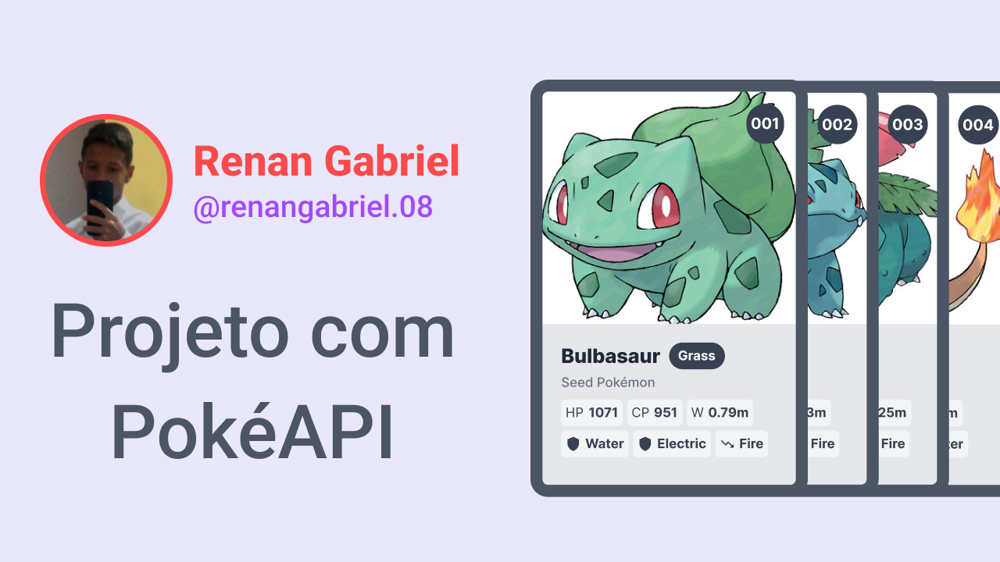

<h1 align="center"> Projeto com PokéAPI </h1>

Site desenvolvido para consumir a API de Pokémon, coletando todos os dados direto da API.

  <a href="#tecnologias">Tecnologias</a>&nbsp;&nbsp;&nbsp;|&nbsp;&nbsp;&nbsp;
  <a href="#projeto">Projeto</a>&nbsp;&nbsp;&nbsp;|&nbsp;&nbsp;&nbsp;
  <a href="#layout">Layout</a>&nbsp;&nbsp;&nbsp;|&nbsp;&nbsp;&nbsp;
  <a href="#memo-licença">Licença</a>

  

 

  

  <h2 style="color: #87CEFA;">🚀 Tecnologias</h2>

  

  Esse projeto foi desenvolvido com as seguintes tecnologias:

  - HTML e CSS
  - SASS
  - JavaScript
  - PokéAPI
  - Git e Github
  

  <h2 style="color: #87CEFA;"> 💻 Projeto </h2>
  Site criado consumindo a API de Pokémon (PokéAPI), puramente com JavaScript, coletando todos os dados direto da API e mostrando-os para o usuário.

  <h2 style="color: #87CEFA;">🔖 Layout</h2>

  Você pode visualizar o layout inicial do projeto através [DESSE LINK](https://www.figma.com/community/file/1104072781039286407). É necessário ter conta no [Figma](https://figma.com) para acessá-lo.
  

## :memo: Licença 

Esse projeto está sob a licença MIT.

---

- Código desenvolvido por Renan :wave: [LinkedIn](https://www.linkedin.com/in/renan-gabriel/) | [Github](https://github.com/renangabriel08)
- [PokeAPI](https://pokeapi.co/)